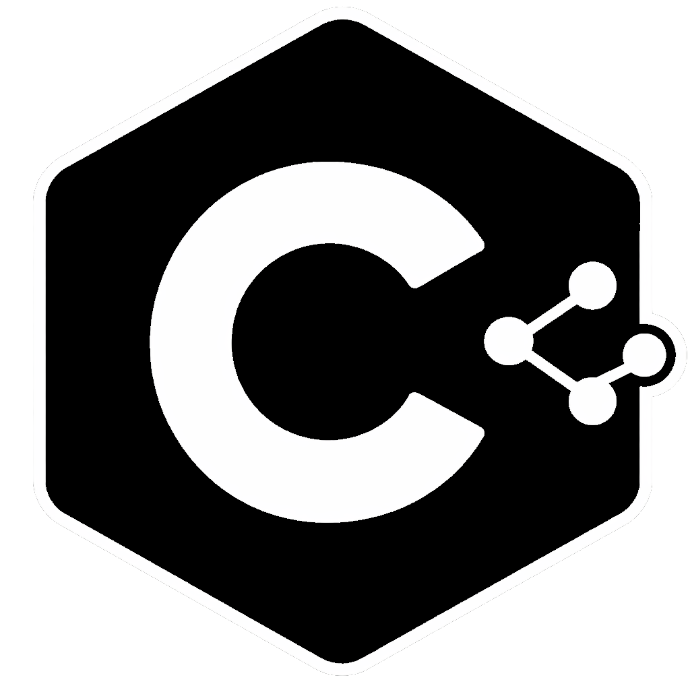

# C Learn
Machine Learning framework written in C.

Implements core ML algorithms and basic data preprocessing utilities from scratch, using only the C standard library (stdio, stdlib, math, string). No external dependencies.

## Features

### Data Preprocessing
- CSV reading and writing
- Feature selection
- Dataset splitting
- Feature scaling:
    - Min-Max normalization
    - Mean normalization
    - Standardization (Z-score)

### Regression
- Univariate linear regression
- Multiple linear regression
- Polynomial regression
- Regularization

### Classification
- Binary classification
- Logistic regression
- Regularization

## Philosophy
- From scratch
- Standard library only
- No frameworks
- Focus on fundamentals

## Status
Work in progress. Built for learning, experimentation, and low-level understanding of ML.

## Author
Boris Mirkovic  
https://www.bm11.dev/
